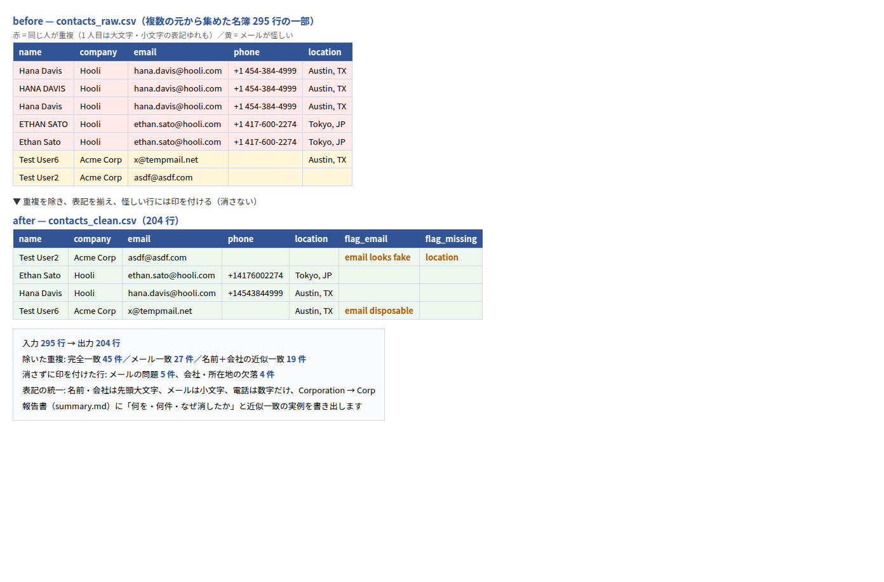

# Contact list cleanup: normalize, dedupe, flag

**The ask this answers:** *"I merged contact lists from three sources. Before this goes into our CRM I need the duplicates gone — but I want to decide what gets deleted."*

| | |
|---|---|
| Input | `contacts_raw.csv` — 295 generated rows with deliberate duplicates, formatting drift and junk emails |
| Output | `contacts_clean.csv` (204 rows) + `summary.md` — what was removed, how many, and why |
| Normalization | Names and companies to Title Case, emails lowercased, phones to digits, `Corporation` → `Corp` |
| Duplicates | ① exact row ② same email ③ fuzzy name + company (rapidfuzz ≥ 92, or initial match + same phone) |
| Flags | Suspicious rows are **kept and marked**, never deleted quietly: missing/invalid email, disposable domain, placeholder-looking, missing company or location |

```bash
pip install -r ../requirements.txt
python make_sample.py
python clean.py contacts_raw.csv -o contacts_clean.csv
```



From `summary.md`:

- Input rows: 295 → Output rows: 204
- Removed: exact duplicates 45 / same-email 27 / near-duplicates 19
- Flagged (kept): email issues 5, missing company or location 4

**The fuzzy threshold is a decision, not a default.** I set it with you: tighter means fewer
false merges, looser means fewer leftovers. The summary file exists so you can audit either way.

**What I would ask you before starting:** which field is the identity key for you (email? phone?),
whether merging should keep the newest or the most complete row, and the target CRM's import format.
