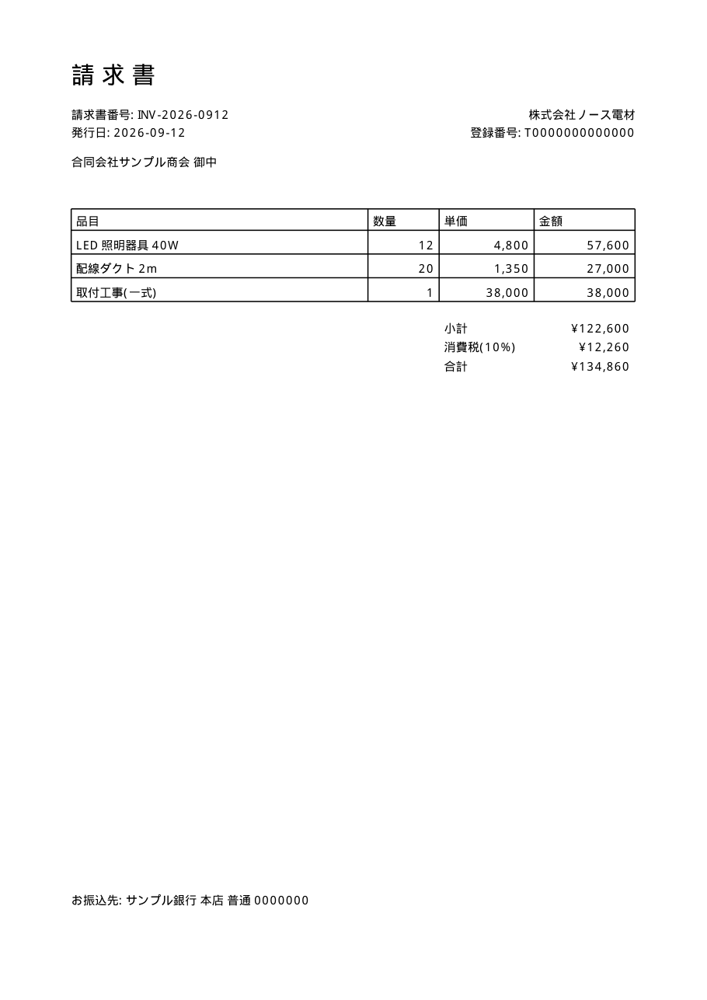
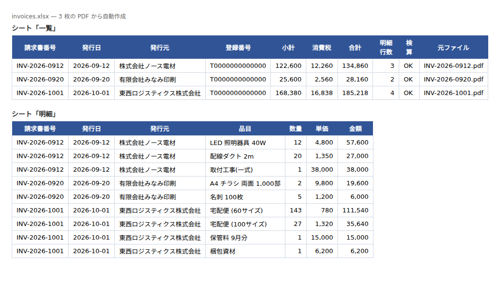

# Invoice PDFs → one Excel workbook

**The ask this answers:** *"Every month I get a stack of supplier invoices as PDFs. I need them in one spreadsheet my accountant can read."*

| | |
|---|---|
| Input | Any number of invoice PDFs. The three in `samples/` are generated, fictional companies |
| Output | `invoices.xlsx` — sheet **Summary** (one row per invoice: number, date, vendor, tax ID, subtotal, tax, total, reconciliation flag) and sheet **Line items** (one row per item) |
| Tools | Python, [pdfplumber](https://github.com/jsvine/pdfplumber) (text + ruled tables), openpyxl |
| Safety net | If the line items don't add up to the stated subtotal, the row is flagged **CHECK** instead of being passed through silently |

```bash
pip install -r ../requirements.txt
python make_samples.py                       # generate the fictional sample PDFs
python extract.py samples/*.pdf -o invoices.xlsx
```




**Scanned (image-only) PDFs** need an OCR pass first. For those I send a short accuracy sample
before quoting, so you can see what the text layer looks like on *your* documents.

**What I would ask you before starting:** one real PDF of each layout you receive, the column
order you want in the output, and whether tax should be split per rate.
