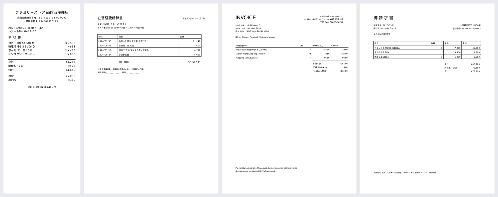
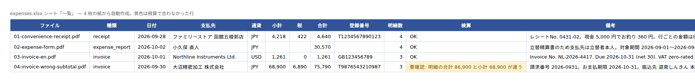

# Mixed-layout receipts & invoices → one spreadsheet (LLM extraction, re-checked)

**The ask this answers:** *"Every month we get receipts and invoices in a dozen different
layouts — Japanese convenience-store receipts, expense forms, invoices from overseas suppliers.
I need them in one sheet, and I need to trust the numbers."*

| | |
|---|---|
| Input | PDFs in **any layout**. The four in `samples/` are generated and fictional: a Japanese convenience-store receipt, an internal expense-reimbursement form, a UK invoice in USD, and a Japanese invoice |
| Output | `out/expenses.xlsx` (sheet **一覧 / Summary**: one row per paper; sheet **明細 / Line items**: one row per item), `out/expenses.tsv` (paste straight into Google Sheets), `out/expenses.json` |
| Tools | Python, [pdfplumber](https://github.com/jsvine/pdfplumber), Claude (`claude-opus-5`) with a JSON schema, openpyxl, gspread (optional) |
| Safety net | **The model's answer is not trusted as-is.** Every number it returns is checked back against the paper: (1) does this amount actually appear in the text? (2) do the line items add up to the subtotal (or the total)? (3) subtotal + tax = total? (4) is the date a real `YYYY-MM-DD`? (5) is there a payee at all? |

```bash
pip install -r ../requirements.txt
python make_samples.py                      # generate the fictional sample PDFs
python extract.py samples/*.pdf --offline   # run the whole pipeline with cached responses — no API key needed
python extract.py samples/*.pdf             # call Claude for real (ANTHROPIC_API_KEY)
python to_sheets.py out/expenses.tsv --sheet "Expenses 2026-09"
```




The fourth row is flagged. That invoice has a **subtotal the supplier got wrong** — the line
items add up to ¥86,900 but the stated subtotal is ¥68,900, one line short. The model reads what
is printed, so it cannot catch this. The reconciliation step does, and the row says `要確認`
(CHECK) instead of flowing silently into your books.

## When an LLM is the wrong tool here

If every document has the same layout, don't use a model. [invoices-to-excel](../invoices-to-excel/)
does that job with coordinates and regexes: faster, free, and identical every run.

An LLM earns its cost only when the layouts *don't* line up — different field names, different
languages, different orders — where rule-writing never ends. The trade is that you now need a
verification layer, which is most of what this demo is.

## What it costs to run (Oct 2026)

Per document: ~1,300 input tokens (text + instructions + schema), ~800 output tokens.

| Model | $/1M in / out | Per document | Per 100 |
|---|---|---|---|
| `claude-opus-5` (default) | $5 / $25 | ~$0.027 | ~$2.70 |
| `claude-haiku-4-5` | $1 / $5 | ~$0.005 | ~$0.50 |

Switch with `--model claude-haiku-4-5`. For a large, tidy batch Haiku is usually enough; messy
scans and handwriting repay the larger model. **I decide by running the first 20 documents through
both and diffing the output** — not by guessing.

## How it's built

- Extraction uses **structured outputs** (`output_config.format` with a JSON schema), so the reply
  always has the same shape and there is no "what if it isn't JSON" branch. `--no-schema` falls
  back to asking for the same fields in prose.
- The instruction is "**null for anything the document does not state — never infer**". Models like
  to fill blanks. The sample receipt prints no per-line amounts, so `amount` comes back null.
- `--offline` replays saved responses from `cached/`, so you can run the whole thing without a key
  before deciding anything. `--save-cache` replaces them with your own.
- **Image-only PDFs (photos, scans) are out of scope here** — they need an OCR pass in front. For
  those I send an accuracy sample from *your* documents before quoting.

## Wiring it into Sheets / n8n / Zapier

`to_sheets.py` writes to Google Sheets with a service-account key; without a key, paste
`out/expenses.tsv` into A1 and you get the same table. `n8n-workflow.json` is the minimal shape
(manual trigger → run the command → append to Sheets); any of these tools can drive it with a
single "run a command" node. Watching a Drive folder or a mailbox is per-client plumbing I build
on top.

**What I would ask you before starting:** one real example of each layout you receive, which
columns you want and in what order, where the sheet lives, and what should happen to a row that
fails reconciliation — flag it, hold it, or email someone.
