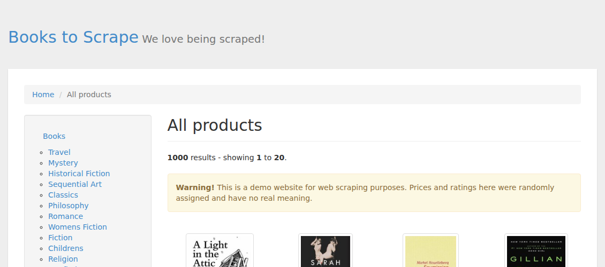
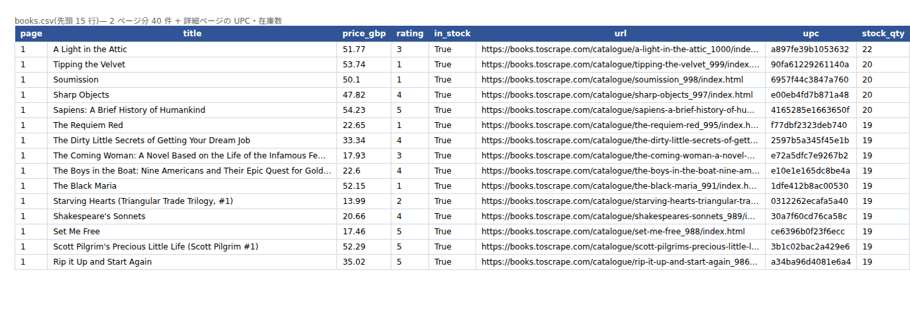

# Paginated listing + detail pages → CSV / Excel

**The ask this answers:** *"I need every product on this site in a spreadsheet. Some fields only exist on the detail page, and I need it refreshed every week."*

| | |
|---|---|
| Target | [books.toscrape.com](https://books.toscrape.com/) — a site published for scraping practice |
| Output | `books.csv` (UTF-8 **with BOM**, so Excel opens it without mojibake) and `books.xlsx` (filters + frozen header) |
| Fields | From the listing: title, price, rating, availability, URL. From each detail page: UPC, stock count |
| Tools | Python, Playwright (works on pages rendered by JavaScript) |
| Manners | A delay between requests (default 0.5 s), one browser, no parallel hammering |

```bash
pip install -r ../requirements.txt
playwright install chromium
python scrape.py --pages 2 --detail -o books.csv    # 40 rows + detail fields
```




**Before I take a scraping job** I read the site's robots.txt and terms, and I tell you what I find.
Sites that require a login, or that forbid automated collection, I will say no to rather than work around.

**What I would ask you before starting:** the exact pages to cover, the fields you need,
how often it should run, and where the output should land (file, Google Sheet, database).
